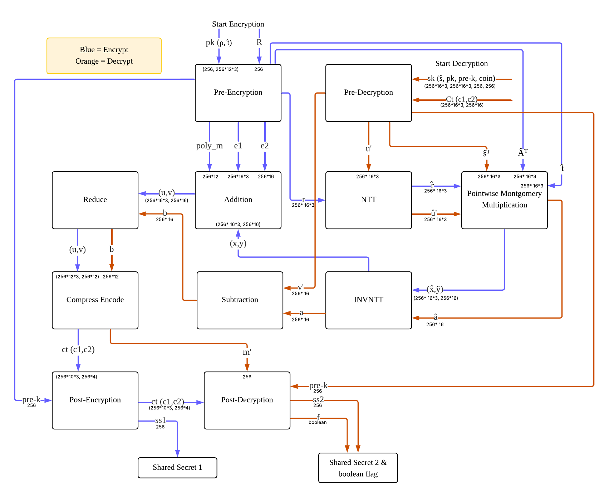

# Kyber768 Cryptography Accelerator on FPGA
This undergraduate senior project implements and accelerates **Kyber768**, a lattice-based post-quantum Key Encapsulation Mechanism (KEM) selected by NIST, using FPGA hardware

The system is written in **SystemVerilog** and deployed on the **Arty S7-50 FPGA board**. It focuses on accelerating core cryptographic operations like encryption and decryption
## Goals 
- Implement Kyber768 cryptographic primitives in hardware
- Optimize latency and throughput
- Analyze FPGA resource utilization
## What is KyberKEM?
Kyber is a post-quantum key exchange mechanism.
Its purpose is to allow two parties to securely agree on a shared secret key, even in the presence of a future quantum computer. Kyber is designed to be secure against quantum attacks.

Kyber does not encrypt data directly.
Instead, it is used to establish a shared secret, which can then be used with fast symmetric encryption (e.g., AES) to protect communication.
## Kyber768 Encryption & Decryption Flowchart

## Operations
### Key Generation (Simulated)
- Results :
    - Public key 
    - Secret key (kept private)
### Encryption (Encapsulation)
- Generates a random shared secret
- Encrypt (encapsulate) the message using public key and noise into a ciphertext
### Decryption (Decapsulation)
- Uses its secret key to recover the **"shared secret"** from the ciphertext
- Compare if the result of the shared secret is the same as the sender's shared secret
- **Result** : Secure communication between 2 parties against future quantum attacks
## Modules
### - Pre_Encryption
### - Pre-Decryption
### - Addition
### - NTT
### - Pointwise Montgomery Multiplication
### - INVNTT
### - Reduce
- Modes : Encryption, Decryption
### - Subtraction
### - Compress Encode
- **Encryption** : Compress ciphertext to get ciphertext with lower coefficient bits
- **Decryption** : Compress Polynomial back to plain text message
### - Post-Encryption
### - Post-Decryption

## Group members
### 1.Pakin Panawattanakul
### 2.Nitchayanin Thamkunanon
### 3.Panupong Sangaphunchai

